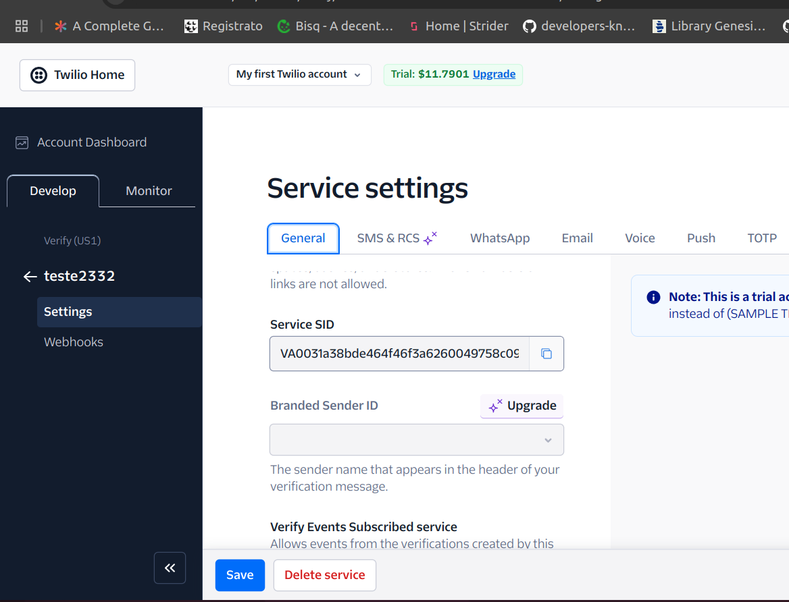

# 🔐 Multi Factor Authentication - Backend

**`En-US`**

## About this project

This project will present how to create an API with JWT authentication / 2 factor authentication. To build this application I use **NodeJS + Express** to create the server, **TypeScript**, **POO and Clean Architecture**. Core lib selected to this project was **Twillio Authy** to provide our 2 factor authentication service and QRcode to generate the TOTP code with any code generator App. To have the full experience you will need to run the [Frontend](https://github.com/IgorBrizack/mfa-authentication-front) and start the server to interact.

## Steps

1.  **Clone the repository**

```
git clone git@github.com:IgorBrizack/mfa-authentication-backend.git
```

2. **Create account at Twillio Website and setup your service configurations**

   - Visit the [Twilio Website](https://www.twilio.com/login)

   - Grab your Account SID and Auth Token

   - Create your service under **Develop** >>> **Verify** and give it a name

   - After creating the service, go to the service settings and **grab your Service SID**

   - If you want, you can change the name that will appear in the authentication app under the TOTP option.

   <p align="center">
    
   </p>

   <br/>

   <p align="center">
    
   </p>

   <br/>

   <p align="center">
    
   </p>

3. **Run with Docker**

```
docker-compose up -d --build
```

3. **Run with Node**

```
npm install
npm run dev
```

4. **Setup your envs** check the .env.example file

5. **The server will start at Port 3100 of your host**

6. **Start the [Frontend](https://github.com/IgorBrizack/mfa-authentication-front)**

---

**`Pt-BR`**

Este projeto apresentará como criar uma API com autenticação JWT e autenticação de dois fatores. Para construir esta aplicação, utilizei NodeJS + Express para criar o servidor, TypeScript, POO e Clean Architecture. A biblioteca principal escolhida para este projeto foi o Twilio Authy, que fornece o serviço de autenticação de dois fatores, e o QRCode para gerar o código TOTP com qualquer aplicativo gerador de código. Para uma experiência completa, será necessário rodar o [Frontend](https://github.com/IgorBrizack/mfa-authentication-front) e iniciar o servidor para interagir.

## Passos

1.  **Clone o reporsitório**

```
git clone git@github.com:IgorBrizack/mfa-authentication-backend.git
```

2. **Crie uma conta no site do Twillio e implemente a configuração do seu serviço**

   - Acesse [Twilio Website](https://www.twilio.com/login)

   - Obtenha o Account SID e Auth Token

   - Crie um serviço em **Develop** >>> **Verify** e dê a ele um nome.

   - Após criar o serviço, vá até as configurações do serviço **pegue o Service SID**

   - Se você quiser, na configuração do TOTP você pode selecionar o nome que irá aparecer no eu aplicativo de autenticação.

   <p align="center">
    
   </p>

   <br/>

   <p align="center">
    
   </p>

   <br/>

   <p align="center">
    
   </p>

3. **Inicie com docker**

```
docker-compose up -d --build
```

3. **Inicie com Node**

```
npm install
npm run dev
```

4. **Defina suas váriaveis de ambiente** observe o arquivo .env.example

5. **O server será iniciado na porta 3100 do seu host**

6. **Inicie o [Frontend](https://github.com/IgorBrizack/mfa-authentication-front)**
