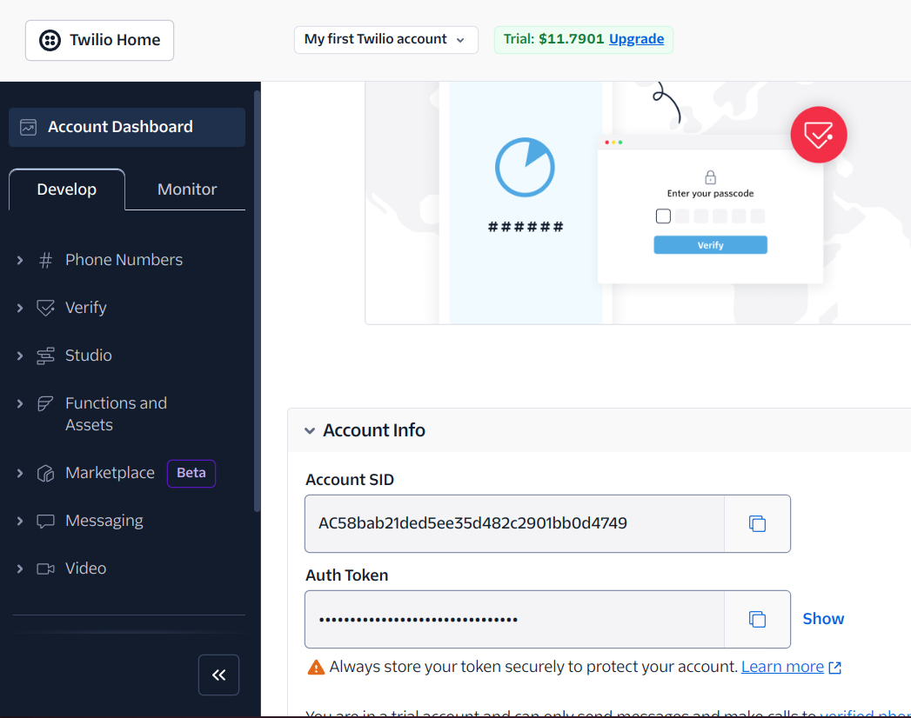
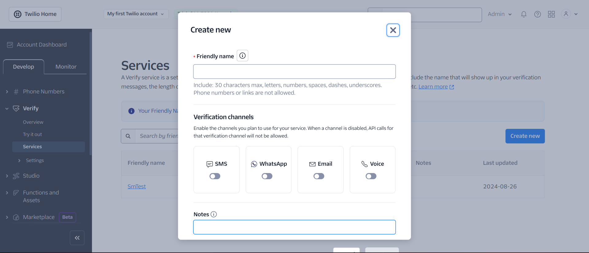

# Multi Factor Authentication - Backend

**`En-US`**

## About this project

This project will present how to create an API with JWT authentication / 2 factor authentication. To build this application I use **NodeJS + Express** to create the server, **TypeScript**, **POO and Clean Architecture**. Core lib selected to this project was **Twillio Authy** to provide our 2 factor authentication service and QRcode to generate the TOTP code with any code generator App. To have the full experience you will need to run the [Frontend](https://github.com/IgorBrizack/mfa-authentication-front) and start the server to interact.

<!-- <div style="display: flex; gap: 10px; margin-bottom: 10px">
  
  
  
</div>
</br> -->

## Steps

1.  **Clone the repository**

```
git clone git@github.com:IgorBrizack/mfa-authentication-backend.git
```

2. **Create account at Twillio Website and setup your service configurations**

   - Website [Twillio](https://www.twilio.com/login)

   - Grab your AccountSID and Auth Token

    <p align="center">
    
    </p>
   - Create your service and give it a name

    <p align="center">
    
    </p>

3. **Run with Docker**

```
docker-compose up -d --build
```

3. **Run with Node**

```
npm install
npm run dev
```

4. **The server will start at Port 3100 of your host**

5. **Start the [Backend](https://github.com/IgorBrizack/mfa-authentication-backend) and setup your envs**

---

**`Pt-BR`**

# Sobre este projeto

ste projeto apresentará como criar uma API com autenticação JWT / autenticação de dois fatores. Para construir esta aplicação, eu usei **NodeJS + Express para criar o servidor**, **TypeScript**, **POO e Arquitetura Limpa**. A biblioteca central escolhida para este projeto foi **Twilio Authy**, para fornecer o serviço de autenticação de dois fatores e o QRcode para gerar o código TOTP com qualquer aplicativo gerador de código. Para ter a experiência completa, você precisará rodar o frontend. [Backend](https://github.com/IgorBrizack/mfa-authentication-backend).

## Passos

1. **Clone o repositório**:

   ```bash
   git clone git@github.com:IgorBrizack/mfa-authentication-front.git
   ```

2. **Execute com Docker**:

   ```bash
   docker-compose up -d --build
   ```

3. **Execute com Node**:

   ```bash
   npm install
   ng start
   ```

4. **Acesse seu localhost 4200**

```
http://localhost:4200
```

5. **Inicie o [Backend](https://github.com/IgorBrizack/mfa-authentication-backend) e configure suas variáveis de ambiente.**
